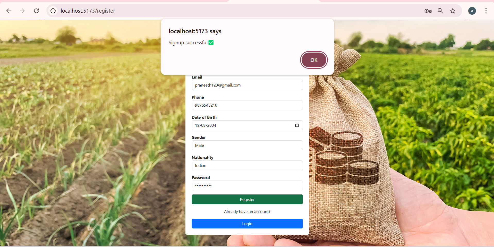
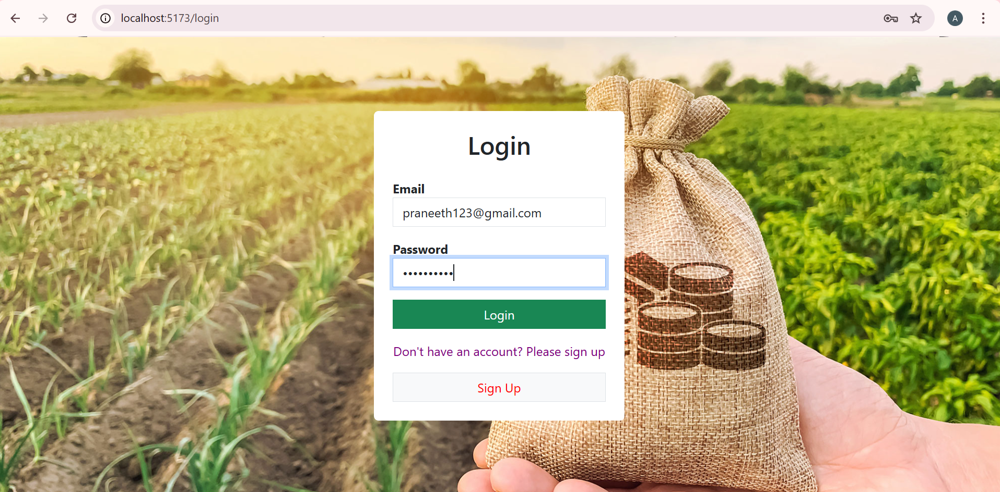
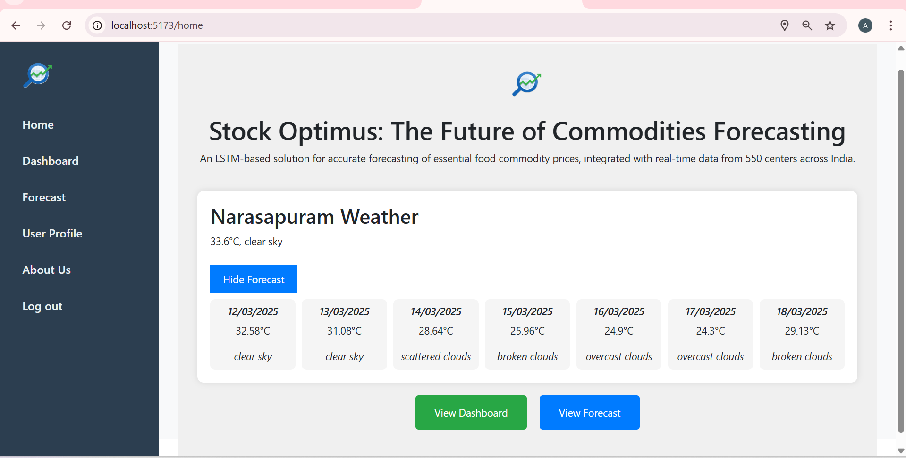
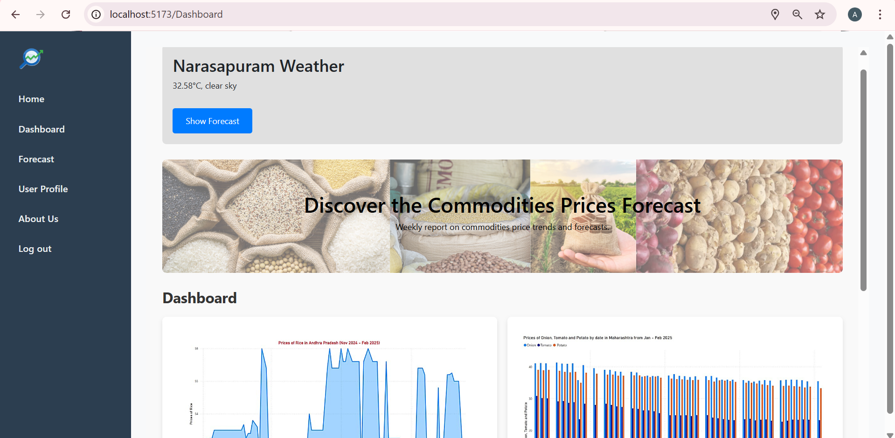
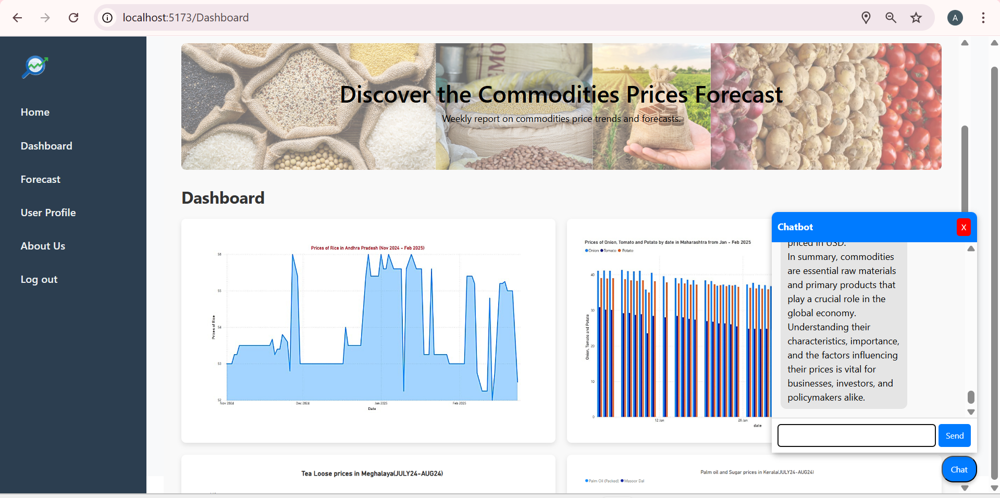
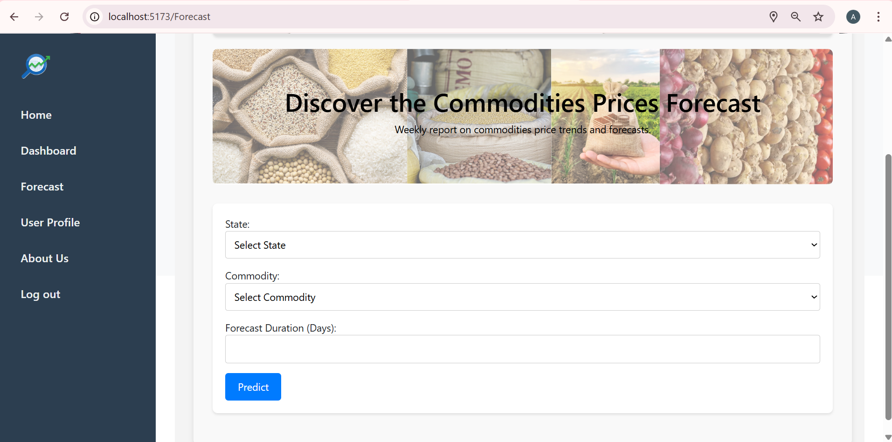
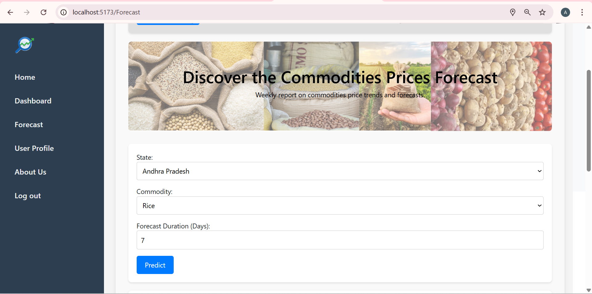
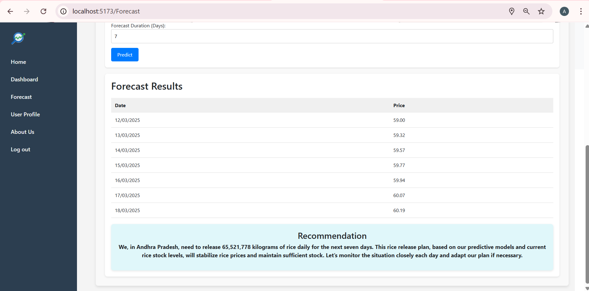
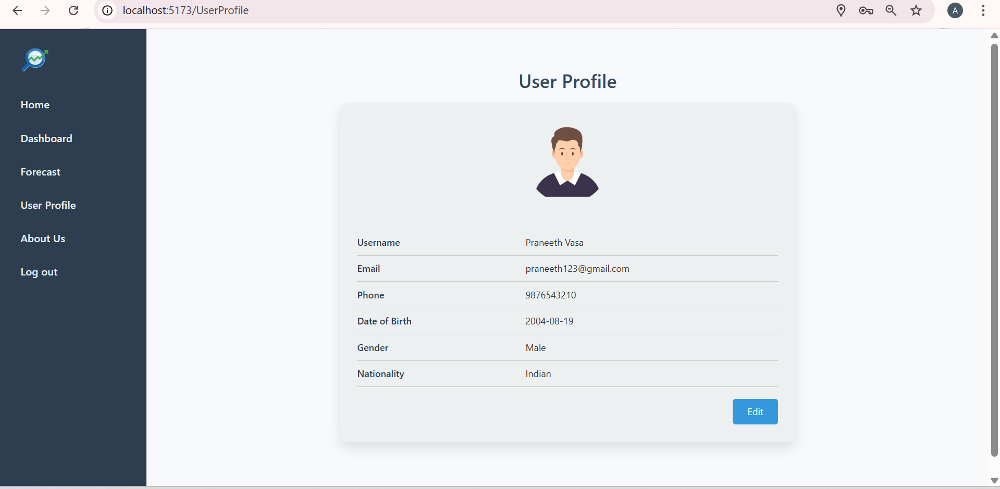
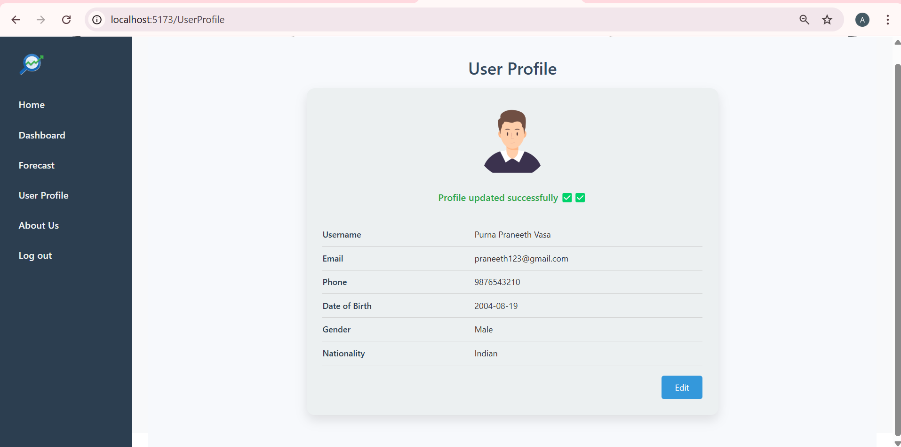

# StockOptimas: The Future of Commodities Forecasting
## Project Overview:
Stock Optimus is an LSTM-based deep learning model designed for accurate prediction and forecasting of prices for 22 essential food commodities across India. The model is powered by real-time data collected from 550 price reporting centers nationwide, ensuring precise and reliable forecasts tailored to the unique market dynamics of India. This project incorporates data on weather conditions, seasonality, and market trends to support timely and informed decision-making by officials.

## Key Features:
- **High-Accuracy Forecasting:** The LSTM model provides accurate predictions based on historical and current market data.
- **Real-Time Data Integration:** Utilizes live data from official sources, ensuring forecasts reflect actual market conditions across India.
- **Weather Data Integration:** Includes real-time weather conditions via an API to account for potential natural calamities affecting prices.
- **Visual Dashboard:** A user-friendly interface with comprehensive visualizations for quick analysis of price trends and forecasts.
- **Buffer Stock Optimization:** Supports strategic market interventions by helping officials decide when to release buffer stocks to stabilize prices.

## Functionality: 
- **Data Collection:** Historical and real-time price data from the official site (http://consumeraffairs.nic.in/price-monitoring-cell/price-monitoring-cell) combined with weather data from an API.
- **Model Training:** The LSTM model is trained using data on crop seasonality, production estimates, emerging market trends, and more.
- **Forecasting:** Predicts price fluctuations and provides weekly or customizable forecasts.
- **Visual Insights:** The dashboard offers clear visual representation of data, enabling decision-makers to quickly understand price movements and trends.

## User Interface
**User Registration: Sign up to get started.**



**Login Screen: Secure login with registered credentials.**



**Home Page: Displays weather data and quick navigation.**



**Dashboard: Visual overview of commodity trends.**



**Dashboard Chatbot: Get instant insights via chatbot.**



**Forecast Page: Allows user to see future trend**



**Forecast Input: Select state, commodity, and duration.**



**Forecast Result: Price Trend and recommedation for policymakers**



**User Profile: Manage your personal information.**



**Edit Profile: Update account details.**



## Technical Details:
Model Type: LSTM (Long Short-Term Memory) Deep Learning Model
Data Sources: Price data from the official government site, weather data from APIs
Programming Languages: Python, JavaScript
Frameworks and Libraries: TensorFlow, Flask for the backend; React.js + Vite for the frontend , mongodb as Data Store
Deployment: The project is deployed on a local server for demo purposes, with potential scalability for cloud deployment.

## How to Run the Project

1. **Clone the Repository**:
   ```bash
   git clone <repository-url>
   ```

2. **Install Dependencies**:
   ```bash
   npm install
   pip install -r requirements.txt
   ```

3. **Run the Application**:
   ```bash
   cd client
   npm run dev

   cd server
   npm start

   python app.py
   ```

4. **Access the Application**:
   Open a web browser and navigate to [http://localhost:5173/home](http://localhost:5173/home).


## Future Enhancements
Expand Commodity Range: Include additional commodities beyond the current 22.
Mobile Optimization: Develop a mobile-friendly version for broader accessibility.
Advanced Analytics: Integrate machine learning-based anomaly detection for early warning alerts.
